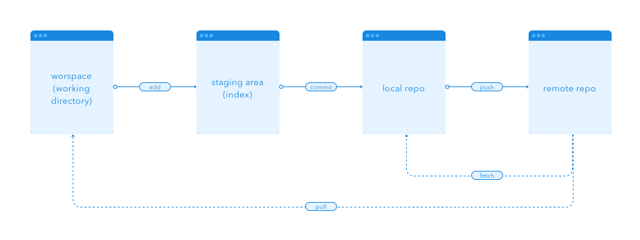

# DesignSystem-Beta

## What on earth is this Git stuff all about
> Think of git as the state of the art in version control. It gives you a TON of control and provides all the features needed 
> to accommodate hundreds of possible workflows. You can maintain multiple versions of a file, conduct multiple experiments and > yet preserve a clean “latest” version of your work. It lets you roll back your changes when needed, and you can even rewrite > history when you feel like it.
> In a nutshell: git is an extremely smart and powerful tool. 
*quote is coming from [Yes, designers can use Git too](https://blog.enki.com/yes-designers-can-use-git-too-79f3cef9c899) article*

#### Local vs out there

#### What's with that tree stuff
Ok, it would try explain branching myslef but why would I do that if somebody already done it in a cute way [here](https://backlog.com/git-tutorial/stepup/stepup1_1.html)

## Starting up
If you haven't got Git Plugin for Sketch, then follow these steps:
- download [git plugin for sketch](https://github.com/mathieudutour/git-sketch-plugin/releases). **Only download latest version using top link**. If for any mysterious reasons the browser asks you to choose file extension, choose .zip
- install plugin (double click)
- it should do 'something' and then appear in your Sketch Plugins
***
### New project
#### Create folder where you add your sketch files

#### Now we'll need to set up Git for your project.A bit terminal work, but you'll manage (make sure to be signed out of Pulse for this GitHub only tutorial)
- First open terminal: open finder window, select Go from systems top bar, select Utilities, there you should see Terminal application - please open :)
- at the moment your terminal is probably in different directory than your file, lets get change it to our project folder
- in terminal window type `cd` and drag your project folder from finder into terminal window (mac magic), and hit Enter. you shoul now be in your project folder

- now use `git init` to set up a project

- then `git add .` to make sure git knows about all the files in your project folder (it wouldn't know until you add them, same if you created a new file that you'd like to be tracked)
- now create your first commit (even if you haven't made any changes yet, this helps for plugin to set up) `git commit -m "NOTE ABOUT YOUR COMMIT NEEDS TO BE PLACED HERE"` (I'd just get comment like Git setup, so you know there is no sketch involved in this on)

#### Now lets set up a remote repository using [github](www.github.com). Create an account if you haven't got one
- login to github, then from the landing page select either "Start project" or "New repository"

- on "Create a new repository" page, pick a name foro your repository and hit "Create repository"
- you should now see home page of your new repository, with setup tips

####  Connect your local repo with remote one
- on this page, make sure HTTPS option is selected at the top of the page
- copy the url
- back in terminal type `git remote add origin` followed by the url you've just copied and hit enter. Note that terminal won't give you a confirmation, if all went ok, it will just start a new line :)

- then push your local repo into remote one with `git push -u origin master`
#### Lets get back to safe and cosy Sketch
- open your sketch file
- then click plugins>Git>Commit (shortcut ctrl + alt + cmd + c) and add note about your changes (Standard Conventions for Commit Messages: Must be in quotation marks, Written in the present tense, Should be brief (50 characters or less))

- You've just created the last step in our Git workflow. A commit permanently stores changes from the staging area inside the repository.
- now it's time to share your work with the A-team, Plugins>Git>Push will push your branch up to the remote

##### What if git says I'm not authorised to see remote repository?
- tell git you want to save your GitHUb password to MacOS keychain. A bit terminal work, but you'll manage (make sure to be signed out of Pulse)
- First open terminal: open finder window, select Go from systems top bar, select Utilities, there you should see Terminal application - please open :)
- at the moment your terminal is probably in different directory than your file, lets get change it to our project folder
- in terminal window type `cd` and drag your project folder from finder into terminal window (mac magic), and hit Enter. you shoul now be in your project folder
- follow instructions [for enabling keychain here](https://help.github.com/articles/caching-your-github-password-in-git/) note that after 3rd point terminal won't give you a confirmation, if all went ok, it will just start a new line
- now you need to add your local repo to GH, and login. Don't worry you'll have to do this only once, then they keychan will remember you
- now you need to add your local repo to GH `git remote add origin git@github.com:skybluemizu/PluginTest.git`. Where "origin" is name of your local repo
